<!-- HEADER -->

 

<!-- SOCIAL BADGES -->

---

## 🧠 About Me

  

---

## 🛠️ Tech Stack

### 🤖 AI · ML · GenAI

### 🔍 RAG · Vector Search · Evaluation

### 🏗️ Backend · APIs · Auth

### 🎨 Frontend

### 🗄️ Databases

### ☁️ Cloud · DevOps · Tools

---

## 📊 GitHub Stats

  
  

  

---

## 📈 Contribution Activity

  

---

<!-- FOOTER -->

  

